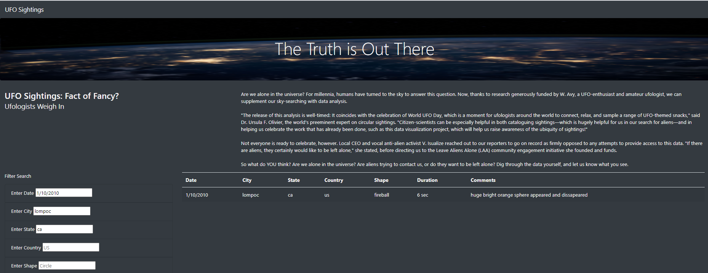

# UFOs
## Overview of Project
This webpage provides an in-depth analysis of UFO sightings by allowing users to filter for multiple criteria at the same time.

## Results

All the filters have a greyed placeholder as an example of what the input could be. In this example, the different filters are being used to select a specific UFO sighting.
1. The date is filtered to 1/10/2010.

2. The state filter is set to ca.

3. The city filtered to lompoc.

4. The data can also be filtered by shape.

5. All the country in the data is "us", so anything besides "us" would give an empty table.

## Summary
One drawback of this design is the fact that the user has to write in the input boxes and if it's not exactly as the value in the data, the web page will return an empty table.

To improve the user experience, there are at least two features that have to be added.
1. The input boxes need a dropdown list with the ability to search the alternatives.
2. Clicking on a value in the table should filter the data to that value. For example, if the user clicks on the state value "ar" on a table row, the table should filter itself to only rows where it's state value is "ar".